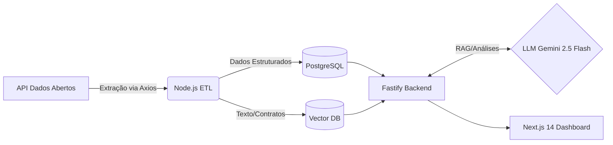

# GovData Insights & LLM Auditor


Pipeline automatizado de auditoria de gastos públicos. Extrai dados de portais governamentais (PNCP, Portal da Transparência), processa com Node.js + TypeScript e utiliza o Google Gemini 2.5 Flash para sumarizar editais, analisar riscos de dispensa de licitação e extrair entidades (NER). O frontend em Next.js 14 com shadcn/ui oferece um dashboard interativo em tempo real.

## Arquitetura



Projeto estruturado como **npm workspaces** com dois pacotes: `@govdata/backend` e `@govdata/dashboard`.

## Stack Tecnológico

### Backend (`packages/backend`)

| Camada | Tecnologia | Detalhes |
|--------|-----------|----------|
| **Runtime** | Node.js 20+ com TypeScript 5.4 (ESM puro — `"type": "module"`) | `tsx` para dev (TypeScript execution via esbuild), `tsup` para build de produção |
| **Framework HTTP** | Fastify 4.26 | Plugins: `@fastify/cors`, `@fastify/multipart` (upload de PDFs) |
| **ORM** | Drizzle ORM 0.29 + `postgres` (driver nativo) | Drizzle Kit para migrations (`drizzle-kit generate/push`) |
| **LLM** | SDK oficial `@google/generative-ai` | Modelo `gemini-2.5-flash` com suporte multimodal (texto + PDF/imagens em base64) |
| **ETL** | Script CLI com `axios` | Extração do PNCP (API pública) ou Portal da Transparência |
| **Validação** | Zod 3.22 | Schemas de runtime para tipos e configurações |
| **Config** | `dotenv` | Variáveis: `DATABASE_URL`, `GEMINI_API_KEY`, `PORTAL_TRANSPARENCIA_API_KEY` |

### Dashboard (`packages/dashboard`)

| Camada | Tecnologia | Detalhes |
|--------|-----------|----------|
| **Framework** | Next.js 14.1 (App Router) | Server Components + Client Components (`'use client'`) |
| **Estilização** | Tailwind CSS 3.4 + `tw-animate-css` | Dark mode via `next-themes` com `ThemeProvider` |
| **UI Components** | shadcn/ui + `@base-ui/react` | Components: Tabs, Button, Skeleton, Sonner (toasts) |
| **Ícones** | lucide-react | FileText, AlertTriangle, Search, Paperclip, Landmark, BarChart3 |
| **Fontes** | Inter via `next/font/google` | Variável CSS `--font-inter` |
| **API Client** | `fetch` nativo (sem axios) | Utilitários em `lib/api.ts` com `NEXT_PUBLIC_API_URL` |

## Como rodar o projeto

### Usando Devcontainer (Recomendado)

1. Instale [Docker](https://www.docker.com/) e [VS Code](https://code.visualstudio.com/).
2. Instale a extensão `Dev Containers` no VS Code.
3. Abra a pasta do projeto → `Reopen in Container`.
4. O ambiente Node.js 20 será configurado com PostgreSQL.

### Localmente (sem Docker)

```bash
# Instalar dependências (workspaces)
npm install

# Configurar variáveis de ambiente
cp .env.example .env
# Edite .env com sua GEMINI_API_KEY

# Rodar migrations do banco
npm run db:push

# Iniciar API + Dashboard
npm run dev
```

Acesse o Dashboard em `http://localhost:8501` e a API em `http://localhost:8000`.

### Scripts Disponíveis

| Comando | Descrição |
|---------|-----------|
| `npm run dev` | Inicia API + Dashboard em paralelo (`concurrently`) |
| `npm run dev:backend` | Inicia a API Fastify com `tsx watch src/index.ts` |
| `npm run dev:dashboard` | Inicia o Next.js Dashboard na porta 8501 |
| `npm run build` | Build de produção (`tsup` backend + `next build` dashboard) |
| `npm run db:generate` | Gera migrations Drizzle |
| `npm run db:push` | Aplica migrations no banco PostgreSQL |
| `npm run db:studio` | Abre Drizzle Studio (GUI do banco) |
| `npm run etl` | Executa ETL: `tsx src/etl/extract-comprasnet.ts` |

## API Endpoints

### `GET /`
Health check simples.

### `GET /health`
Status do servidor.

### `POST /api/analyze/edital`
Resumo estruturado de editais de licitação.
- **Body:** `{ "text": "conteúdo do edital" }`
- **Response:** `{ "summary": "resumo em tópicos" }`

### `POST /api/analyze/risk`
Análise de risco de dispensa de licitação com base legal (Lei 14.133/2021).
- **Body:** `{ "text": "justificativa da dispensa" }`
- **Response:** `{ "nivel_risco": "BAIXO"|"MEDIO"|"ALTO", "analise": "justificativa" }`

### `POST /api/analyze/entities`
Extração de entidades (NER) — empresa, CNPJ, valor, órgão contratante.
- **Body:** `{ "text": "trecho de diário oficial" }`
- **Response:** `{ "entidades": [...] }`

### `POST /api/analyze/document`
Auditoria multimodal de documentos (PDF/imagens). Aceita upload de até 3 arquivos (10MB cada).
- **Body:** `multipart/form-data` com campo `files`
- **Response:** `{ "analysis": { "indicios_sobrepreco", "nivel_risco", "justificativa", "valor_total" } }`

## Estrutura do Projeto

```
govdata-insights/
├── backend/
│   └── src/
│       ├── index.ts            # Inicialização do Fastify
│       ├── config/env.ts       # Variáveis de ambiente (dotenv + Zod)
│       ├── api/routes.ts       # Rotas da API (4 endpoints + health)
│       ├── db/
│       │   ├── connection.ts   # Conexão PostgreSQL via postgres.js + Drizzle
│       │   └── schema.ts       # Schema da tabela 'licitacoes'
│       ├── llm/agent.ts        # Funções LLM: summarize, risk, NER, multimodal
│       └── etl/
│           └── extract-comprasnet.ts  # Script de extração (PNCP/Portal Transparência)
├── dashboard/
│   └── src/
│       ├── app/
│       │   ├── layout.tsx      # Root layout com ThemeProvider + Inter font
│       │   ├── page.tsx        # Home page com header + DashboardTabs
│       │   ├── _components/    # DashboardTabs.tsx, ThemeToggle.tsx
│       │   ├── error.tsx       # Error boundary
│       │   ├── loading.tsx     # Loading state
│       │   └── not-found.tsx   # 404
│       ├── components/         # shadcn/ui components
│       │   ├── ui/             # button, tabs, skeleton, sonner
│       │   ├── EditalSummaryTab.tsx
│       │   ├── RiskAnalysisTab.tsx
│       │   ├── EntityExtractionTab.tsx
│       │   └── DocumentAuditTab.tsx
│       └── lib/
│           ├── api.ts          # Cliente fetch para a API backend
│           └── utils.ts        # Utilitário cn() (clsx + tailwind-merge)
├── data/                       # Dados brutos
├── temp_uploads/               # Uploads temporários de documentos
├── tsconfig.base.json          # Config compartilhada (ES2022, ESNext modules, bundler resolution)
├── package.json                # Root workspace (concurrently)
└── .env.example
```

## Licença

MIT — Copyright (c) 2026 Lucas Stevan Rodrigues Oliveira.
