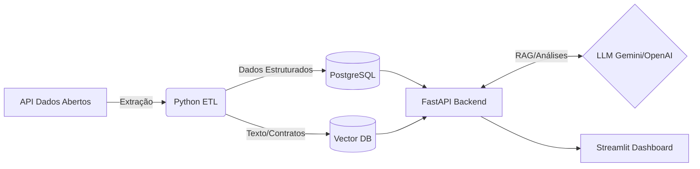

# GovData Insights & LLM Auditor


## O Problema
Órgãos públicos geram um volume massivo de diários oficiais, editais de licitação e contratos. Para um cidadão ou gestor, é difícil auditar essas informações e cruzar dados de gastos públicos com eficiência.

## A Solução
Um pipeline de dados automatizado que extrai informações de portais públicos, processa os dados e utiliza um LLM para resumir editais complexos, identificar anomalias (ex: sobrepreço) e classificar o nível de risco ou categoria do gasto.

## Arquitetura

O fluxo de dados da aplicação segue a seguinte arquitetura:



## Stack Tecnológico
- **Linguagem Core:** Python 3.11+
- **Orquestração e Ambiente:** Docker, Docker Compose e Devcontainer
- **Pipeline de Dados:** Scripts Python estruturados
- **Armazenamento:** PostgreSQL (Relacional) e Vector Database (ChromaDB)
- **Motor LLM:** LangChain com Gemini/OpenAI
- **Apresentação:** Streamlit
- **API:** FastAPI

## Como rodar o projeto localmente

O projeto está configurado para rodar nativamente em um **Devcontainer** do VS Code, garantindo um ambiente de desenvolvimento limpo, reprodutível e isolado.

### Usando Devcontainer (Recomendado)
1. Instale o [Docker](https://www.docker.com/) e o [VS Code](https://code.visualstudio.com/).
2. Instale a extensão `Dev Containers` no VS Code.
3. Abra a pasta `govdata-insights` no VS Code.
4. Clique em `Reopen in Container` no pop-up que aparecer (ou abra a paleta de comandos `Ctrl+Shift+P` e digite `Dev Containers: Reopen in Container`).
5. O VS Code fará o build do ambiente, instalando todas as dependências do `requirements.txt` e subindo o PostgreSQL e os containers auxiliares via Docker Compose.
6. Dentro do terminal do container, inicie a API ou o Dashboard:
   - Para iniciar o banco de dados: `psql -h db -U govuser -d govdata`
   - senha: `govpassword`
   - Para iniciar o Dashboard: `streamlit run dashboard/app.py`
   - Para iniciar a API: `uvicorn src.api.main:app --host 0.0.0.0 --port 8000 --reload`

### Usando Docker Compose apenas
Se desejar apenas subí-los e conferir os serviços, sem interagir via VS Code:
```bash
docker-compose up --build -d
```
Acesse o Dashboard em `http://localhost:8501` e a documentação da API em `http://localhost:8000/docs`.

## Decisões Arquiteturais (ADRs)
- **PostgreSQL em vez de NoSQL:** Optou-se por PostgreSQL devido à natureza fortemente estruturada e relacional dos dados de licitação (valores, datas, CNPJs, órgãos).
- **Streamlit para Apresentação:** Escolhido pela velocidade de prototipagem e integração nativa com Python, permitindo exibir insights do LLM rapidamente.
- **FastAPI para Backend:** Utilizado para servir análises do LLM e dados do banco de forma assíncrona, além de gerar documentação OpenAPI (Swagger) automaticamente.
- **Devcontainer:** Adotado para isolar as dependências e configuração do projeto em qualquer SO (Windows/Mac/Linux), mitigando problemas com instalação de bibliotecas e conflitos locais.
